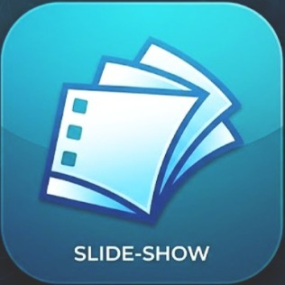

# App_SlideShow | Fond Memories

An elegant, browser-based cinematic slideshow web application designed to showcase your travel memories in stunning visual quality. Built with vanilla HTML/JS and Tailwind CSS.



## 🌟 Key Features

* **Cinematic Ken Burns Effect**: Active slides experience a slow, continuous zoom-in transition matching the playback interval.
* **Seamless Cross-Dissolve Transitions**: Features a smooth `800ms` integration transition between pictures.
* **Auto-Play with Distraction-Free Presentation**: The configuration bar automatically hides when starting, maximizing viewing space.
* **Custom Location Overlays**: Overlay a large, stylized destination name (e.g. city or landmark) on the initial slides.
* **Smart Client-side Importing**: Sorts selected pictures alphabetically to preserve local sorting sequence before loading them as fast local object URLs.
* **Custom End Screen**: Shows a stunning branded end screen with the "William H. Chan Travel + Eats" logo upon completion.

---

## 🛠️ Technology Stack

* **Structure**: Semantic HTML5
* **Styling**: Tailwind CSS & CSS3 Custom Animations
* **Logic**: Vanilla Javascript (ES6)
* **Metadata & SEO**: Open Graph tags optimized for social sharing and debuggers

---

## 🚀 Quick Start / How to Run

Since the application runs entirely client-side, no local server setup is required:

1. **Clone/Download the repository**:
   ```bash
   git clone https://github.com/<your-username>/App_SlideShow.git
   cd App_SlideShow
   ```
2. **Open `index.html`**:
   Double-click `index.html` or open it directly in Google Chrome, Microsoft Edge, Safari, or Mozilla Firefox.
3. **Configure and Play**:
   * Type in your travel destination name in the input box.
   * Click **Choose Pictures** and select your photos.
   * Press the **Start** button to run the presentation.
   * Hover near the top-right corner and click **Hide Settings / Show Settings** to toggle the configuration header manually.

---

## 📁 Repository Structure

```
App_SlideShow/
├── index.html        # Main single-page application entry point
├── README.md         # Project documentation and guide
├── og-image.jpg      # Open Graph image / cover preview
└── logo.png          # Branded logo for ending screen
```

---

## 📸 Personalization

* **Ending Logo**: You can swap out `logo.png` with any custom circular logo to personalize the end slide.
* **OG Cover**: Swap `og-image.jpg` with a preview screenshot of your own travels to display on link sharing platforms.

---

Created with ❤️ by **William H. Chan Travel + Eats**.
